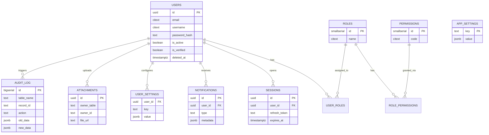

# Entity Relationship Diagram



`ATTACHMENTS` uses a polymorphic pattern (`owner_table` + `owner_id`) so it can
attach a file to a row in **any** table without a dedicated foreign key per
entity — this is what makes the schema reusable across projects.


# Entity Relationship Diagram

```mermaid
erDiagram
    USERS ||--o{ USER_ROLES : has
    ROLES ||--o{ USER_ROLES : assigned_to
    ROLES ||--o{ ROLE_PERMISSIONS : has
    PERMISSIONS ||--o{ ROLE_PERMISSIONS : granted_via
    USERS ||--o{ SESSIONS : opens
    USERS ||--o{ NOTIFICATIONS : receives
    USERS ||--o{ configures
    USERS ||--o{ ATTACHMENTS : uploads
    USERS ||--o{ AUDIT_LOG :
    USERS {
        uuid id PK
        citext email
        citext username
        text password_hash
        boolean is_active
        boolean is_verified
        timestamptz deleted_at
    }

